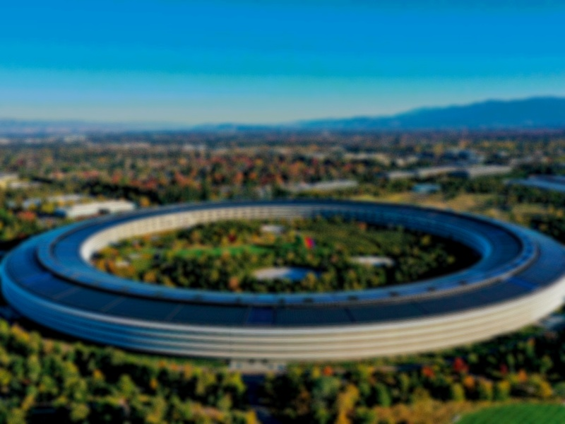
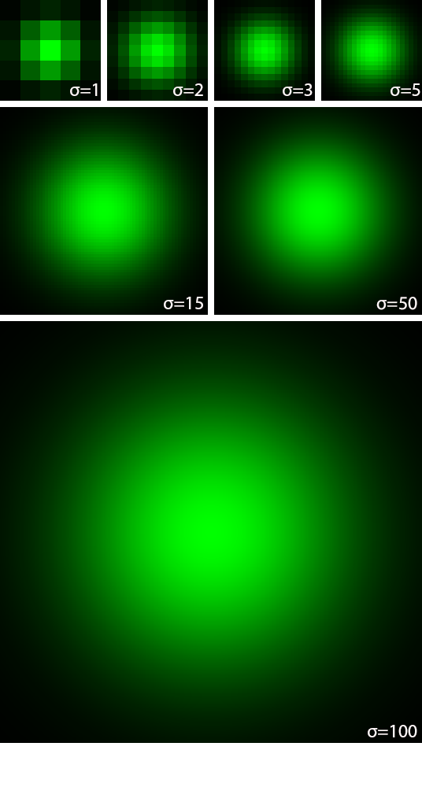

# imageproc

<div align="center">
    
    </br>
    <div align="center">
        <em>
            27x Kernel Gaussian Blur computed with M1 MacBook Pro 2020
        </em>
    </div>

</div>
</br>

All code related to CS260: Image Processing course, *American University of Armenia*, Fall 2023 and in general to the field

Author: Gevorg Nersesian, gevorg_nersesian@edu.aua.am    

## Usage

In a terminal window of a directory with your image file, type
```bash

python3 code/main.py [inputFilePath] --[mode] [parameter_OPTIONAL]

```
both *.png* and *.jpg* files are supported

In your directory you will find an inverse of the inputted image


## Modes

`grayscale` `gray`: applies grayscale

`inverse`: finds the color inverse

`boxblur` `blur`: applies box blur

- takes in initialization as its parameter (default = 3)

`gaussianblur` `gaussian`: applies gaussian blur

- takes in standard deviation as its parameter (default = 1)

`edges`: identifies the edges

- takes in initialization as its parameter (default = 0.5)

`sharpen`: inverse of blurring

- takes in initialization as its parameter (default = 4)


## Kernels

Gaussian blur Kernels with different standard deviations

Note: algorithm automatically resizes the matrix to fit at least 95% of the distribution
<div align="center">
    
</div>
