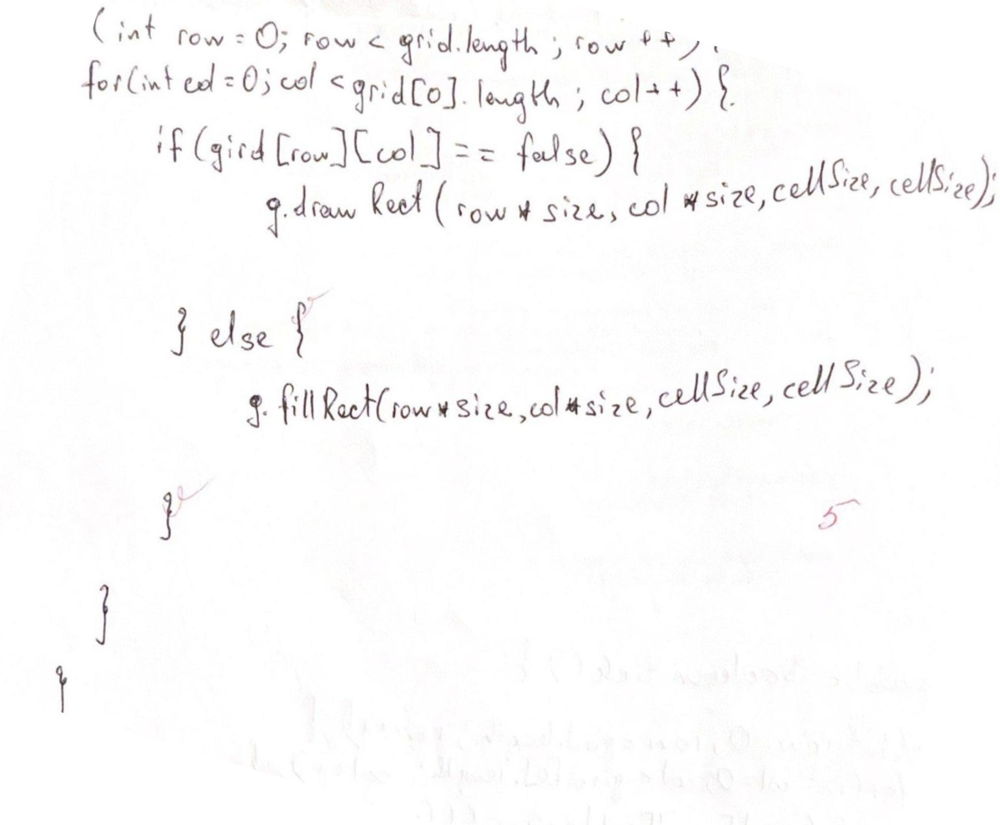

# imageproc

<div align="center">
    
    </br>
    <div align="center">
        <em>
             Maximal Threshold Gaussian Blur computed with M1 MacBook Pro 2020
        </em>
    </div>

</div>
<br>

Diverse algorithms implementing mathematical concepts of the Image Processing field.

Author: Gevorg Nersesian, unstoppablehay@gmail.com

License: see above

## Usage

In a terminal window of a directory with your image file, type
```bash

python3 code/main.py [inputFilePath] --[mode] [parameter_OPTIONAL] [saveFilename_OPTIONAL]

```
both *.png* and *.jpg* files are supported

In your directory you will find an inverse of the inputted image


## Modes

`grayscale` `gray`: applies grayscale

`inverse`: finds the color inverse


#### Convolution based

`boxblur` `blur`: applies box blur

- takes in initialization as its parameter (default = 3)

`gaussianblur` `gaussian`: applies gaussian blur

- takes in standard deviation as its parameter (default = 1)

`edges`: identifies the edges

- takes in initialization as its parameter (default = 0.5)

`sharpen`: inverse of blurring

- takes in initialization as its parameter (default = 4)


## Kernels

- <font color="red">Red</font> represents negative values
- <font color="green">Green</font> represents positive values
- <font color="black">Black</font> represents zero

#### Edge Detection, Sharpening, Box Blur
<div align="center">
    
</div>
<br>

#### Gaussian Blur

Note: algorithm automatically resizes the matrix to fit at least 95% of the distribution
<div align="center">
    
</div>

## Automatic Rotation

### Original
<div align="center">
    
</div>

### First Stage: Pre-Processing, Angle Approximation

<div align="center">
    
    
    
</div>

### Second Stage: Enhanced Processing and Angle Approximation

<div align="center">
    
    
</div>

### Final Result: Locate Lines, Find Angle and Rotate
<div align="center">
    
    
</div>

Find additional examples in the `examples` folder (`16.jpg` is original, `16p.jpg` is processed)